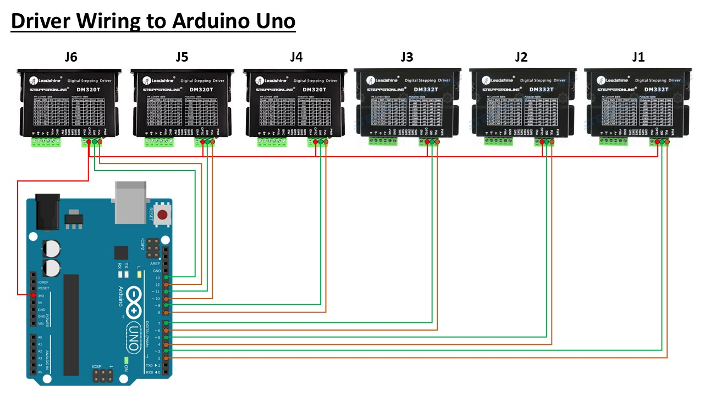
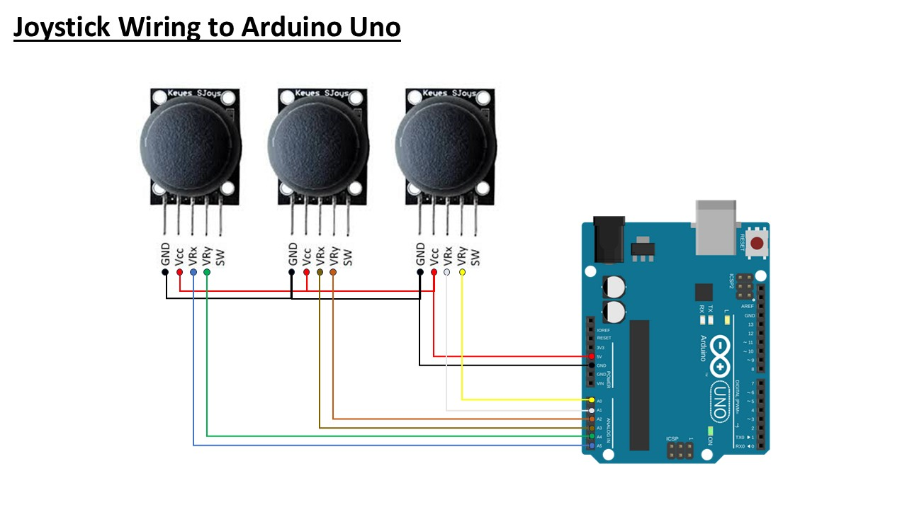
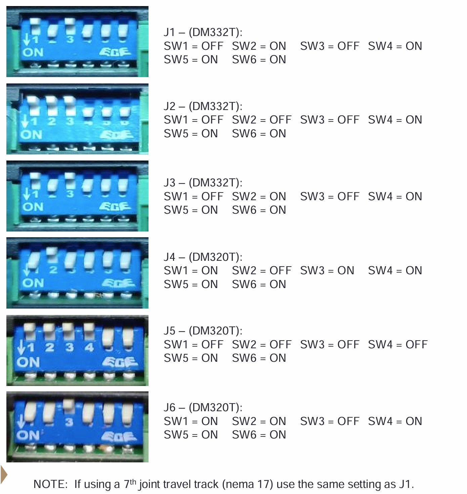

# AR4 MK3 Joystick Controlled Using Arduino Uno
This project shows the wiring from driver to Arduino Uno for the AR4 MK3 robotic arm.

## Wiring Diagram
### Driver to Arduino Uno

### Joystick to Arduino Uno

### DIP Switch Setttings

### Youtube Reference

  

Click the image above to watch the video.
