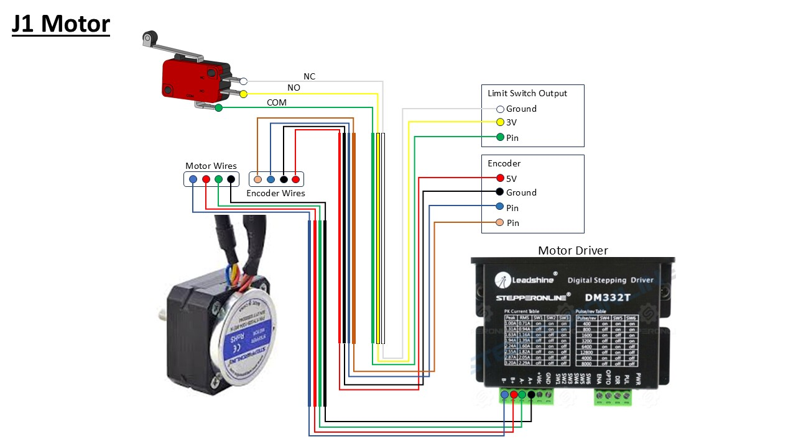
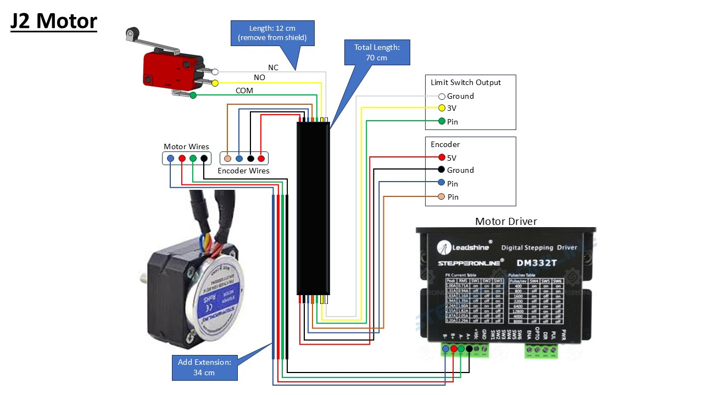
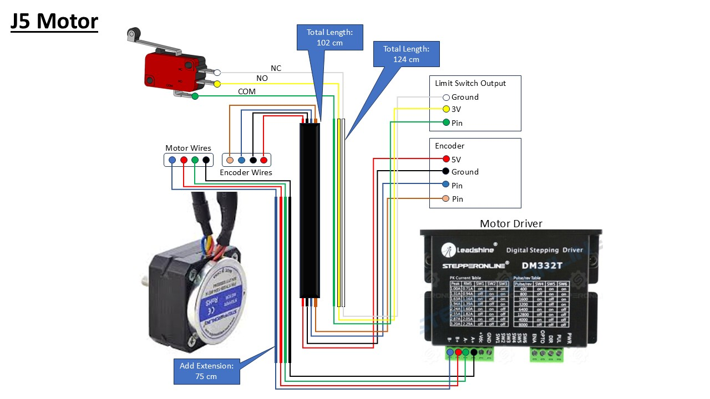
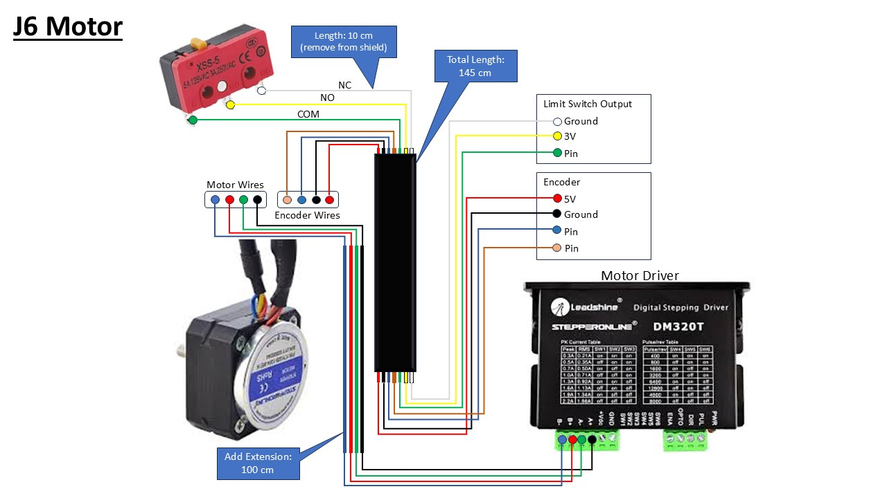

# AR4 MK3 Wiring Guide
This project shows the wiring from motor to driver for the AR4 MK3 robotic arm.

## Wiring Diagram
### J1 Motor

### J2 Motor

### J3 Motor

### J4 Motor

### J5 Motor

### J6 Motor

### Youtube Reference

  

Click the image above to watch the video.
